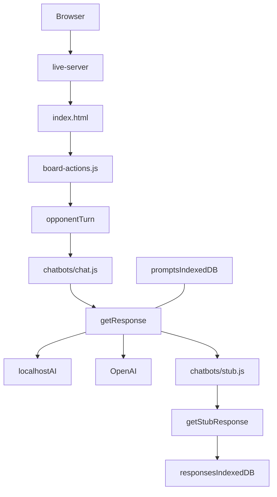

```mermaid
flowchart TD
    Browser --> live-server --> index.html
    index.html --> board-actions.js --> opponentTurn
    opponentTurn --> chatbots/chat.js --> getResponse
    promptsIndexedDB --- getResponse
    getResponse --> localhostAI
    getResponse --> OpenAI
    getResponse --> chatbots/stub.js --> getStubResponse
    getStubResponse --> responsesIndexedDB
```